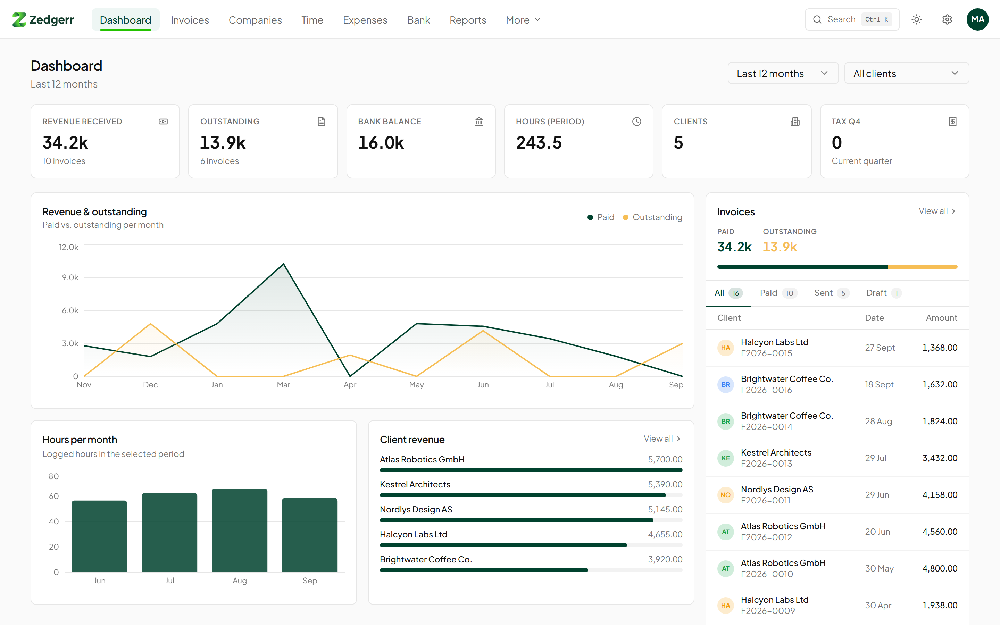
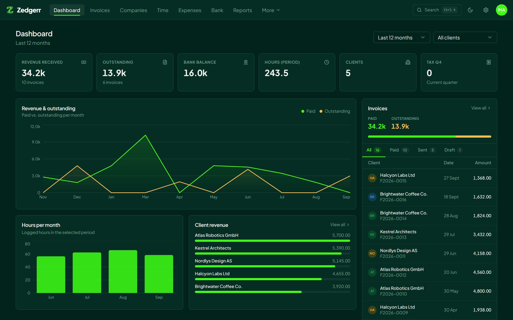
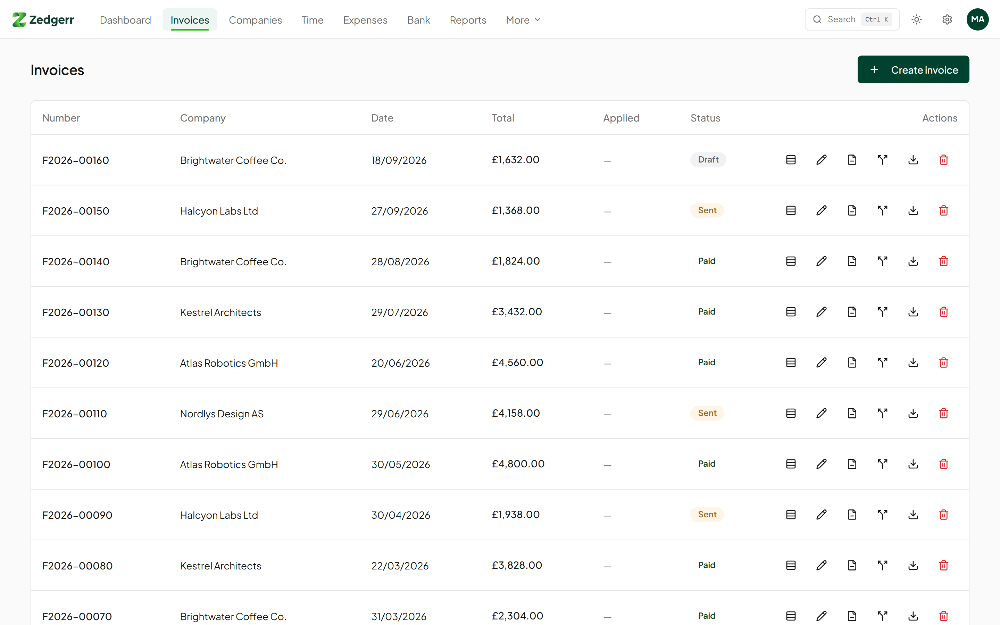
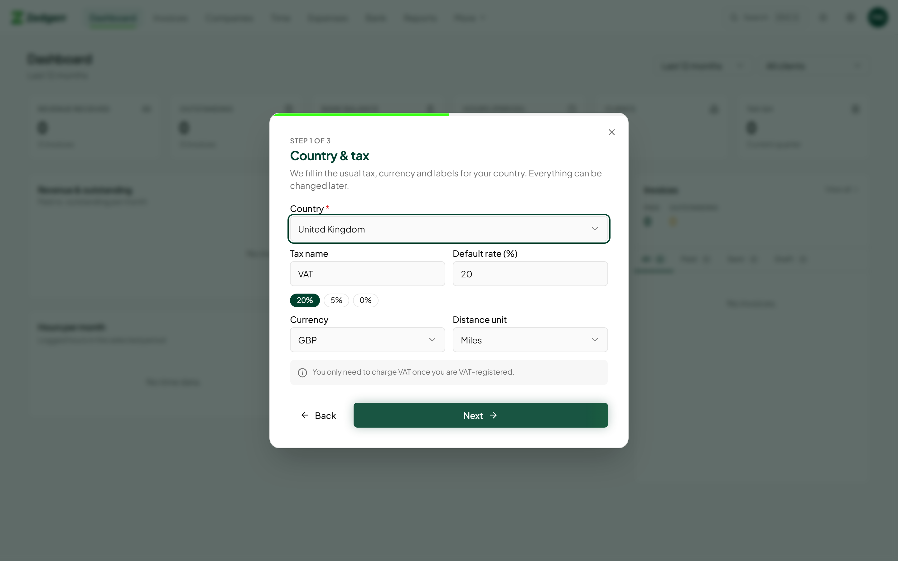
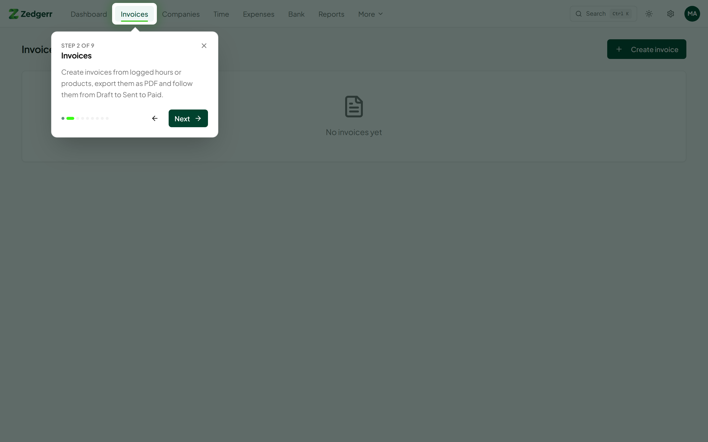
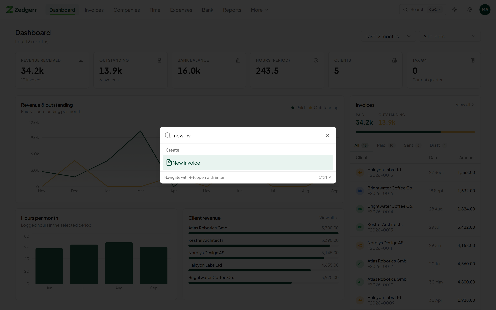
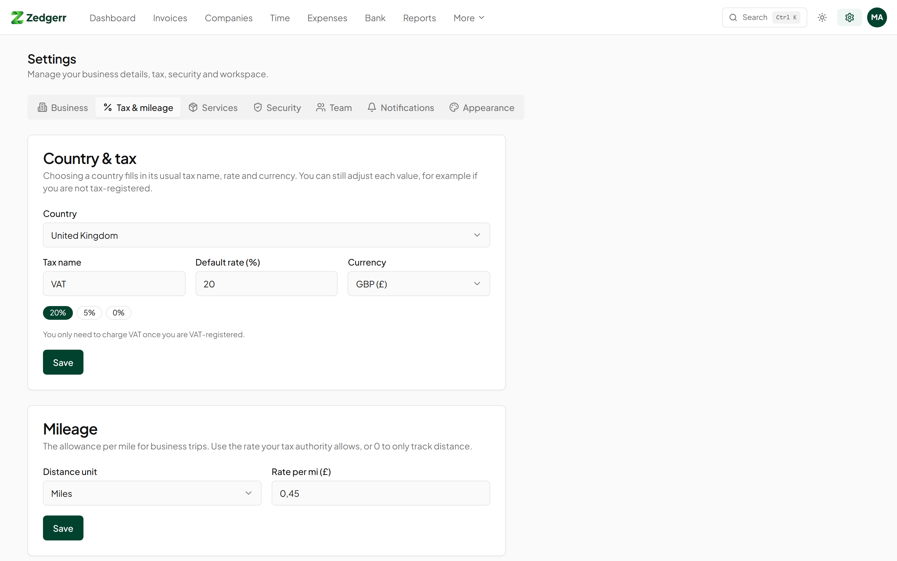
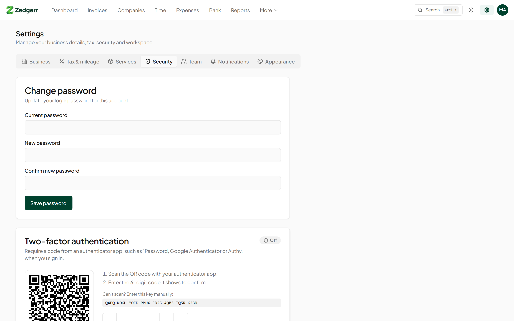
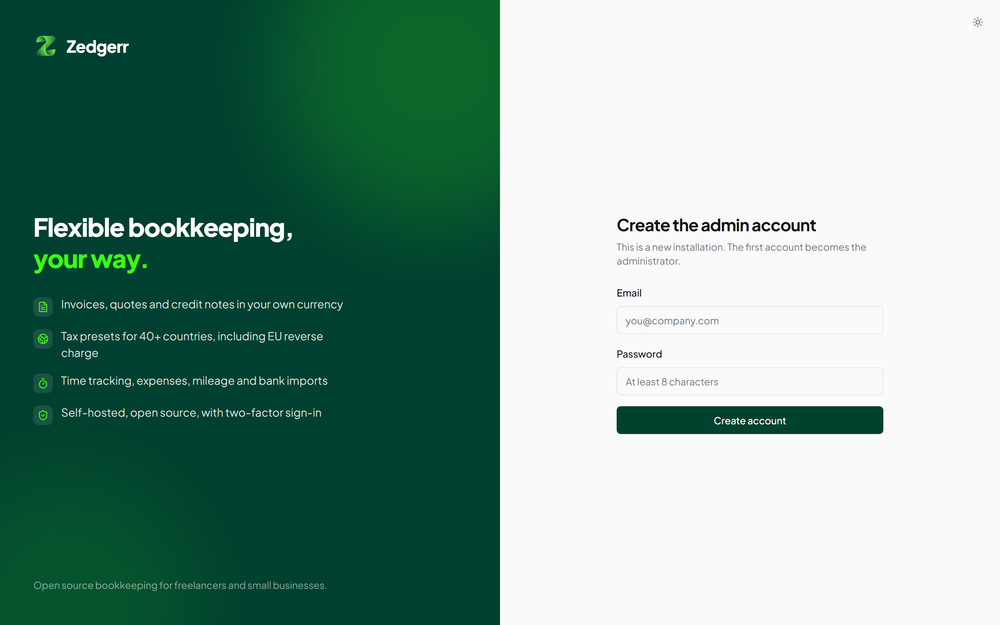
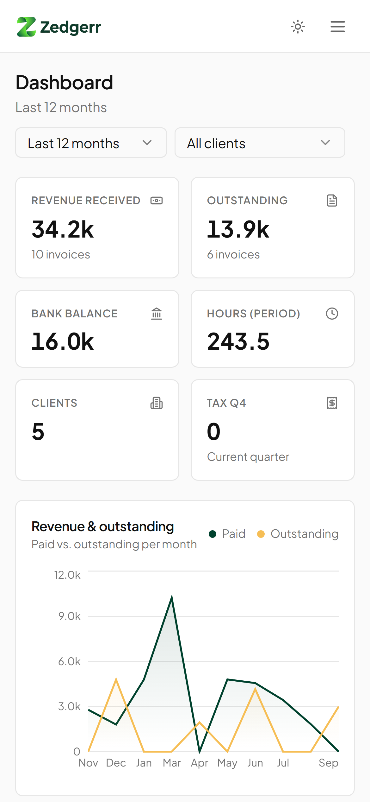

<p align="center">
  
</p>

<p align="center">
  <strong>Flexible bookkeeping, your way.</strong><br>
  Open-source invoicing, time tracking and bookkeeping for freelancers and small businesses.<br>
  Self-hosted with one Docker command. Works in 40+ countries.
</p>

<p align="center">
  <a href="LICENSE"></a>
  
  
</p>



## Why Zedgerr

Most invoicing tools are built for one country and rent your own data back to you. Zedgerr runs on your own server, keeps everything in a single SQLite file you can back up, and adapts to the tax rules of the country you work in: VAT, GST, HST, sales tax or none at all.

## Features

**Get paid**
- Invoices, quotes and credit notes with clean PDF export
- Turn logged hours or products into invoice lines in one click
- Split an invoice into instalments, apply client credit or advance payments
- EU reverse-charge invoices with the legally required wording
- Client portal where your clients see their hours and invoices

**Know where you stand**
- Dashboard with revenue, outstanding invoices, bank balance and tax due
- Tax summary per quarter: output tax, input tax and the balance to pay or reclaim
- Profit and loss, balance sheet and a double-entry ledger with chart of accounts
- Reports per client and period

**Track everything in one place**
- Time tracking per client with custom hourly rates
- Expenses with receipt uploads (photos and PDFs)
- Mileage log in kilometres or miles at the allowance rate you set
- Bank CSV import with matching suggestions
- Subscriptions, leads, products and daily notes

**Built to be used every day**
- Guided setup that collects every detail your invoices need, then a product tour
- Command palette (<kbd>Ctrl</kbd>/<kbd>⌘</kbd> + <kbd>K</kbd>) to jump anywhere or create anything
- Light and dark mode, responsive down to phone screens
- Two-factor authentication with any authenticator app, plus recovery codes
- Team members with roles (owner, admin, member, viewer)
- Encrypted database backup and one-click restore from **Settings → Data**
- SMTP email settings for sending team invites directly from the app

## Screenshots

| | |
|---|---|
|  |  |
| **Dark mode** | **Invoices** |
|  |  |
| **Setup wizard with country presets** | **Guided product tour** |
|  |  |
| **Command palette** | **Country & tax settings** |
|  |  |
| **Two-factor authentication** | **Sign in** |

<p align="center">
  
</p>

## Works where you work

Pick your country during setup and Zedgerr fills in the tax name, standard and reduced rates, currency, distance unit and the right labels for your registration and tax numbers. Everything stays editable.

| Region | Included |
|---|---|
| European Union | All 27 member states, with current 2026 VAT rates and reverse charge for cross-border B2B work |
| Europe (other) | United Kingdom, Switzerland, Norway |
| Americas | United States (sales tax, off by default for services), Canada (GST, HST or GST + PST per province), Mexico, Brazil |
| Asia-Pacific | Australia (GST + ABN), New Zealand, Singapore, Japan, India (GSTIN) |
| Africa and Middle East | South Africa, United Arab Emirates |

Your country isn't listed? Choose **Other country** and set your own tax name and rate.

> Zedgerr helps you keep your books and prepare your figures. It is not tax advice; check your return with your tax authority or an accountant before filing.

## Quick start

### Docker Compose (recommended)

```bash
git clone https://github.com/vMawk/zedgerr.git
cd zedgerr
docker compose up -d
```

Open <http://localhost:3000>. The first account you create becomes the administrator, and the setup wizard guides you through the rest.

### Docker

```bash
docker build -t zedgerr .
docker run -d --name zedgerr -p 3000:3000 \
  -e JWT_SECRET="$(openssl rand -hex 32)" \
  -v zedgerr_data:/app/data \
  zedgerr
```

### Node.js

Requires Node.js 22 or later.

```bash
npm ci
npm run build && npm run build:server
JWT_SECRET="$(openssl rand -hex 32)" NODE_ENV=production node dist-server/server/index.js
```

## Configuration

| Variable | Default | Description |
|---|---|---|
| `JWT_SECRET` | *required in production* | Random string of at least 32 characters. Generate one with `openssl rand -hex 32`. |
| `PORT` | `3000` | Port the server listens on. |
| `DATA_DIR` | `./data` | Folder for the SQLite database and uploaded files. |
| `ALLOW_REGISTRATION` | `false` | `true` lets anyone create an account. The first account can always be created. Invite others from **Settings → Team**. |
| `TRUST_PROXY` | `false` | Set to `true` behind nginx, Caddy or Traefik so rate limiting sees the real client IP. |
| `CORS_ORIGIN` | | Comma-separated origins, only needed when another domain calls the API directly. |
| `OPENAI_API_KEY`, `OPENAI_BASE_URL`, `OPENAI_MODEL` | | Optional OpenAI-compatible endpoint for the "Improve with AI" button on time entries. |

## Running in production

- **HTTPS:** put Zedgerr behind a reverse proxy that terminates TLS, and set `TRUST_PROXY=true`.
- **Backups:** use **Settings → Data → Backup** to download an AES-256-GCM encrypted backup (`.zdbk` file). You choose the password; it never leaves your server. Restore from the same tab.
- **Updates:** pull the new version and rebuild. Database migrations run automatically on start-up.
- **Health check:** `GET /healthz` returns `{"status":"ok"}` when the server and database are up.

- **Remote access:** [Cloudflare Tunnel](https://developers.cloudflare.com/cloudflare-one/connections/connect-networks/) is supported — no port forwarding or certificates needed. Set `TRUST_PROXY=true` when using it.

### Forgotten password

There is no email-based reset, because a self-hosted install has no mail server configured by default. An administrator can set a new password from the server:

```bash
# Docker
docker compose exec app node dist-server/server/reset-password.js user@example.com 'new-password'

# Node.js
npm run reset-password -- user@example.com 'new-password'
```

Add `--disable-2fa` if the user also lost their authenticator app and recovery codes.

## Security

- Passwords hashed with PBKDF2-SHA-256; sessions signed with your `JWT_SECRET`
- Optional TOTP two-factor authentication with single-use recovery codes and replay protection
- Rate limiting on sign-in, registration and two-factor endpoints
- Security headers on every response; uploads are type- and size-checked and stored outside the web root
- Container runs as a non-root user

Found a vulnerability? Please report it privately to the maintainer instead of opening a public issue.

## Development

```bash
npm install
npm run dev
```

This starts the API on port 3000 (with auto-reload) and the Vite dev server on <http://localhost:8080>. A **DEV** button in the bottom-left corner lets you rerun the setup wizard or the product tour.

| Command | Purpose |
|---|---|
| `npm run dev` | API and frontend with hot reload |
| `npm run build` | Production build of the frontend |
| `npm run build:server` | Compile the API and server to `dist-server/` |
| `npm run lint` | ESLint |
| `npm test` | Unit tests (Vitest) |

### Project structure

```
api/          Hono API: routes, auth, two-factor, types
server/       Node.js entry point, SQLite and file storage adapters, admin scripts
migrations/   SQL migrations, applied in order on start-up
src/          React app (Vite, Tailwind, shadcn/ui)
  pages/      One file per screen
  components/ Layout, onboarding, command palette, settings
  lib/        API client, tax presets, PDF generation
```

### Tech stack

React 18, TypeScript, Vite, Tailwind CSS, shadcn/ui, Framer Motion, TanStack Query and Recharts on the frontend; Hono, better-sqlite3 and Node.js 22 on the server; jsPDF for invoices.

## Contributing

Issues and pull requests are welcome. For larger changes, please open an issue first to discuss the approach. New country presets are a great first contribution: see `src/lib/tax-presets.ts`.

## License

[MIT](LICENSE) © Mark van Viegen
